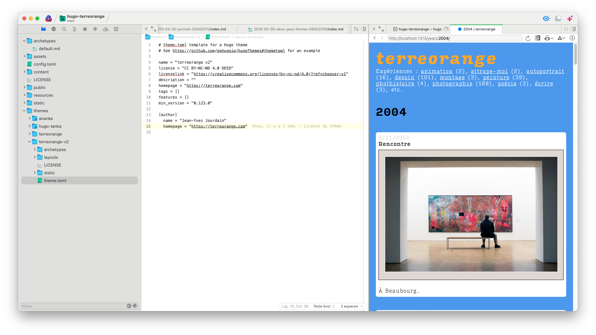

# Pourquoi changer ?

Mon site [terreorange.com](https://terreorange.com) est pris en charge par WordPress depuis belle lurette. Et puis, l’envie de changer, de tester de nouvelles technologies et l’arrivée de l’IA générative[^1] m’ont poussé à aller voir ailleurs si l’herbe était plus verte.
<!--more--> 
Ce qui m’a aussi motivé, ce sont les expériences des autres. Je lis régulièrement MacG et celles d’[Anthony Nelzin-Santos](https://zinzolin.fr/sommaire/) et de [Nicolas Furno](https://nicolasfurno.fr/) m’ont orienté vers [Hugo](https://gohugo.io/). (Et dès lors, j’avais des exemples desquels je pouvais m’inspirer.)

Cette technologie semblait cocher toutes les cases :

- Basée sur le format Markdown que j’utilise depuis des années.
- Open source et ouverte.
- Possibilité d’avoir tous mes *posts* en local (et donc possibilité de facilement faire des traitements de fond).
- Génération d’un site statique et donc excellentes performances en vue.
- Facilité avec laquelle on peut fabriquer son thème.
- Etc.

Le choix fut donc vite fait.

# Comment faire ?

N.B. Mon but n’est pas d’expliquer ce qu’est Hugo ni comment cela fonctionne[^2], ni de détailler comment j’ai procédé, mais de décrire mon cheminement.

J’utilise plusieurs machines Apple, Mac, iPad, iPhone… Il fallait donc que je puisse créer du contenu de partout. Je me suis dit : « Ben, il n’y a qu’à utiliser un dossier dans iCloud, non ? ». Petit souci, une fois le contenu créé, il faut exécuter Hugo pour générer le site. 

J’aurais pu utiliser une de mes machines qui aurait généré régulièrement le site à partir du dossier iCloud. Mais j’ai regardé comment les personnes citées ci-dessus ont procédé et l’option GitHub m’a intéressée. Après tout, cela me permettait de tester quelque chose de nouveau, non ?

Et ce n’est pas si compliqué, il suffit de créer un *[repository](https://github.com/terreorange/hugo-terreorange/tree/main)* sur GitHub et grâce aux [Workflows](https://docs.github.com/en/actions/using-workflows/about-workflows)[^3], on peut générer automatiquement le site quand le * repository* est modifié. C’est beau !

Et l’hébergement du site alors ? J’ai un hébergement Web chez OVH depuis longtemps. J’ai donc simplement continué dans cette voie[^4]. Et vous savez quoi, on peut demander à GitHub de [pousser le site généré vers un serveur FTP](https://github.com/SamKirkland/FTP-Deploy-Action).

# La récupération du contenu

Pour exporter mes données, j’ai d’abord utilisé [ wordpress-to-hugo-exporter ](https://github.com/SchumacherFM/wordpress-to-hugo-exporter). Je souhaitais surtout récupérer mes *posts* qui sont pour la plupart des images. J’ai ensuite fait un gros travail de mise en forme avec des scripts Python et avec de l’huile de coude ! (Mon site est modeste, c’était donc envisageable.) Je suis d’ailleurs en train d’en profiter pour remettre en ligne des photos qui avaient disparu quand j’étais passé à Wordpress.

# Le thème

On trouve facilement des [thèmes](https://themes.gohugo.io) clé en main. Mais tant qu’à faire, je me suis dit que j’allais faire le mien. J’ai pu ainsi m’initier au [Go](https://go.dev) (Go, Hugo, vous suivez ?) et replonger dans le CSS. D’ailleurs, j’ai découvert que l’on pouvait [utiliser les polices Adobe Fonts sur un site Web](https://helpx.adobe.com/fr/fonts/using/add-fonts-website.html) (si on dispose d’un abonnement bien sûr.)

J’ai avancé du côté des [taxonomies](https://gohugo.io/content-management/taxonomies/) pour pouvoir afficher les posts par années ou par catégories par exemple. Mais je n’ai pas encore trouvé comment pouvoir passer de post en post quand on se trouve dans une catégorie…

À un moment, je me suis demandé comment faire pour afficher la bannière RGPD, jusqu’à ce que je réalise que je n’avais pas à la mettre puisque je n’utilisais aucun cookie ! (Enfin, je l’espère !)

En tout cas, pour chaque situation, les exemples ne manquent pas sur le Web, c’est très aidant.

# Avec quels outils ?

Pour travailler sur mon thème, j’utilise [Nova](https://nova.app). C’est un éditeur intégré qui permet de tout avoir sous le coude : le code d’un côté et le résultat de l’autre. (Hugo permet de générer à la volée le site en tenant compte des modifications que vous êtes en train de faire.) Pour GitHub, je n’ai pas réussi à utiliser de manière fluide Nova (pour l’instant). J’utilise donc le client officiel [GitHub Desktop](https://desktop.github.com). Sur mon iPad, pour GitHub, j’utilise l’excellente application [Working Copy](Working%20Copy) qui permet de livrer le contenu du * repository* sous la forme d’un disque.

À partir de là, pour le contenu, je peux utiliser n’importe quel outil, tant qu’il permet de générer du Markdown. Je ne publie pas beaucoup, mais je pourrais utiliser des scripts qui automatisent les choses…

# Alors, heureux ?

Oui, c’est amusant, car ces choix nécessitent de mettre en œuvre beaucoup de technologies. Je suis ravi du résultat et, effectivement, la vitesse n’a rien à voir. Le passage de WordPress à Hugo fait perdre quelques fonctionnalités natives comme les statistiques, mais, comme toujours, il y a des solutions. (Je suis en train de tester [Plausible](https://plausible.io/open-source-website-analytics).) Bref, il y a encore du pain sur la planche.

Et voilà ! comme disent nos amis anglophones.

[^1]:	Qui me pousse à avoir un meilleur contrôle de mes données. D’autant plus que des accords semblent en cours entre [Automaticc, la maison mère de WordPress et OpenAI et MidJourney](https://www.engadget.com/tumblr-and-wordpress-posts-will-reportedly-be-used-for-openai-and-midjourney-training-204425798.html?guccounter=1&guce_referrer=aHR0cHM6Ly9kdWNrZHVja2dvLmNvbS8&guce_referrer_sig=AQAAAMawoP2dCCico0_narpopYI9h1mdU-DGZPE3ALmzsHdG1OO7f4aN_hZ41CzYVjHUJxETSm6vtx67D_DAkiN3e-CkUfQHeyZkE6Fxz9mrX89gVUqNGLCLKJvQ7PsqEs2GIhyzts2GXAvphlZ-1LsL9-Lwhe1xesdCTpJS-x9llR0S).

[^2]:	On trouve facilement des exemples sur le Web, mais voilà la [page officielle](https://gohugo.io/getting-started/usage/) pour démarrer.

[^3]:	Celui que j’emploie, que j’ai bricolé à partir d’exemples glanés à droite et à gauche, est [ici](https://github.com/terreorange/hugo-terreorange/blob/main/.github/workflows/static.yml).

[^4]:	Cela dit, j’ai vu que l’on pouvait même faire [héberger son site sur GitHub Pages](https://gohugo.io/hosting-and-deployment/hosting-on-github/) gratuitement !