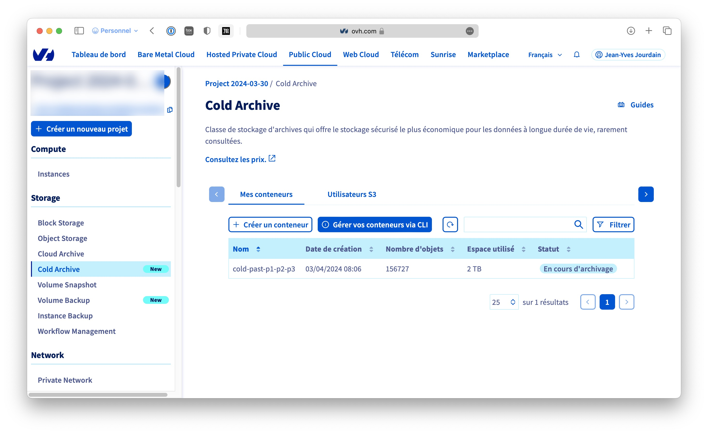

Si je me souviens bien, mon premier appareil photo numérique fut un Nikon Coolpix quelque chose ; j'ai ensuite sauté le pas et acquis un [Nikon D100](https://en.wikipedia.org/wiki/Nikon_D100)[^1]. Si je ne dis pas de bêtises. (Je vieillis et il est possible que je perde la mémoire.) Plus de 20 ans après, je me retrouve avec plus de **100 000 photos**. (Je vous rassure, je n'emploie plus ces boîtiers, mais je suis resté fidèle à Nikon, D200, D70, D700[^2], Z6[^3], Zfc…)

Je gère mes photos dans Adobe Lightroom Classic. Et j'ai donc un magnifique dossier de **2 TO** environ. Pour mes sauvegardes, je suis fidèle au principe [**3-2-1**](https://www.veeam.com/blog/321-backup-rule.html) : je vais évoquer dans cet article le **1** de la formule. J'utilise actuellement Dropbox pour garder une copie hors site de mes précieuses œuvres[^4], **Dropbox** auquel je n'aurai plus accès sous peu. Quand j'ai vu qu'OVH proposait une offre Cold Archive, je me suis dit que j'allais y jeter un œil. Voilà la [description](https://help.ovhcloud.com/csm/fr-public-cloud-storage-cold-archive-overview?id=kb_article_view&sysparm_article=KB0056196) d'OVH : en gros, c'est un système de stockage de type Cloud Public[^5] qui permet de sauvegarder des données sur bandes à un prix bas.

Pour le stockage, il existe d'autres options chez OVH Cloud Public :

- Object Storage : un système souple qui permet de stocker des données pour un usage courant. Il existe une version High Performance. Ces systèmes sont basés sur les API S3 (celles d’Amazon AWS). Prix : 0,007 € HT/mois/Go.
- Cloud Archive : comme son nom l'indique, permet de faire des sauvegardes. Moins cher que les systèmes précédents, basé sur l’API OpenSwift, mais avec une latence de récupération de plusieurs minutes. (C'est fait pour sauvegarder.) Prix : 0,0024 € HT/mois/Go et on paie le trafic entrant et sortant. (Mieux vaut ne pas passer son temps à ajouter et supprimer, mais c’est fait pour sauvegarder.)
- Etc.

Et donc **Cold Archive**. Avantages : pas cher ; les données peuvent être en France ; pas de limite de stockage, etc. Inconvénient : il y a une rétention minimale de 180 jours et l’on est facturé pour un minimum de 1 TO. Prix : 0,0013 € HT/mois/Go et on paie la sortie des données 0,005 €. Mais comme on n’est censé sortir ces données qu’en cas de fin du monde — voir le principe 3-2-1 — pourquoi pas ? Je sors ma calculette : stocker mes 2 TO devrait me coûter environ 0,0013\*2048 € soit un gros 3 € par mois ; les restaurer, environ 12 €. Oui, non ? Banco !

---- 

# Comment ça marche ?

1. Créer un conteneur qui fera office de tampon.
2. Y copier les données à archiver avec les API S3 ou avec [`rclone`](https://rclone.org).
3. Archiver le conteneur.
4. Vérifier.

J’ai commencé par lire [Object Storage - Premiers pas avec Object Storage](https://help.ovhcloud.com/csm/fr-public-cloud-storage-s3-getting-started-object-storage?id=kb_article_view&sysparm_article=KB0047354#utilisation-de-aws-cli) puis j’ai enchaîné par [Cold Archive - Premiers pas avec Cold Archive](https://help.ovhcloud.com/csm/fr-public-cloud-storage-cold-archive-getting-started?id=kb_article_view&sysparm_article=KB0047342).

## Créer le conteneur

Dans OVH Manager, j'ai créé mon projet Public Cloud. Dans Cloud Archive, j'ai créé un conteneur et l’utilisateur dont je vais me servir pour y accéder. (J'ai pris le soin de noter tous les identifiants et autres secrets, mais il est possible de la retrouver plus tard.)

## Copier les données

J’ai commencé par installer `awscli` pour utiliser directement les API S3. Avant de me rendre compte qu’utiliser `rclone` était plus pratique (pour moi). J’ai donc installé ce dernier[^6] :

	brew install rclone

J’ai suivi les instructions de [Object Storage - Utiliser S3 Object Storage avec Rclone](https://help.ovhcloud.com/csm/fr-public-cloud-storage-s3-rclone?id=kb_article_view&sysparm_article=KB0047465). Et cela fonctionne aussi avec Cold Archive ! Il s'agit principalement de remplir ce type de fichier[^7] :

	[<profile_name>]
	type = s3
	provider = Other
	env_auth = false
	access_key_id = <access_key>
	secret_access_key = <secret_key>
	endpoint = https://s3.<region_in_lowercase>.perf.cloud.ovh.net
	acl = private
	region = <region_in_lowercase>
	location_constraint = <region_in_lowercase> _

Pour connaître les valeurs des champs `endpoint`, `region` et `location\_constraint`, je suis allé dans OVH Manager, puis dans Cold Archive, j'ai cliqué sur Gérer vos conteneurs via CLI. `access\_key\_id` et `secret\_access\_key` sont à trouver dans Utilisateurs S3 (toujours dans OVH Manager).

OK. Mon profil se nommant `glacial`, j’ai testé :

	rclone lsd glacial:

Je vois le conteneur `cold-past-p1-p2-p3` que j’ai créé dans l’interface OVH Manager. Ça marche !

Du coup, pour copier les données, c’est facile :

	rclone copy /mon-dossier-d-images-local glacial:cold-past-p1-p2-p3

Là, théoriquement, tu as le temps de boire un café, de préparer le repas du soir, de regarder une série, bref, tu as le temps. (Avec ma fibre, je pense que cela a pris entre 15 et 20 heures en tout, je n'ai rien noté.)

## Archiver

Une fois que les données sont copiées, il ne reste plus qu'à indiquer qu'il faut les archiver, là aussi, j'ai d'abord envisagé d'utiliser une ligne de commande telle qu'elle est décrite dans la documentation, genre :

	aws --endpoint-url https://s3.rbx-archive.io.cloud.ovh.net put-ovh-archive mon-dossier-d-images

Jusqu'à voir le magnifique "Archiver " dans le menu … de mon conteneur. C'est donc ce que j'ai employé. À l'heure où j'écris ces lignes, l'archivage est toujours en cours. Je pense que là aussi, il va falloir être patient.

## Vérifier

Dans quelque temps, je testerai la récupération des données, je vous tiens au courant.

---- 

À suivre donc.

J’oubliais, OVH offre 200 € pour tester son Cloud Public pendant un mois (si j’ai bien compris), c’est le moment de regarder.

[^1]:	La version anglaise est nettement plus fournie que la version française.

[^2]:	Mon préféré !

[^3]:	Vivement le Z6 III !

[^4]:	Qui comprennent aussi des photos mal cadrées et floues d'enfants, mais comme ce sont les miens, je les trouve géniales.

[^5]:	Un Cloud Public permet de louer des ressources à la demande et de payer en fonction de l’usage.

[^6]:	Je suis sous macOS. Voir [Homebrew](https://brew.sh) pour installer ce dernier.

[^7]:	Dans OVH Manager, il y a une option au niveau de l'utilisateur S3 pour télécharger le fichier `rclone`, mais je ne suis pas parvenu à la faire fonctionner.